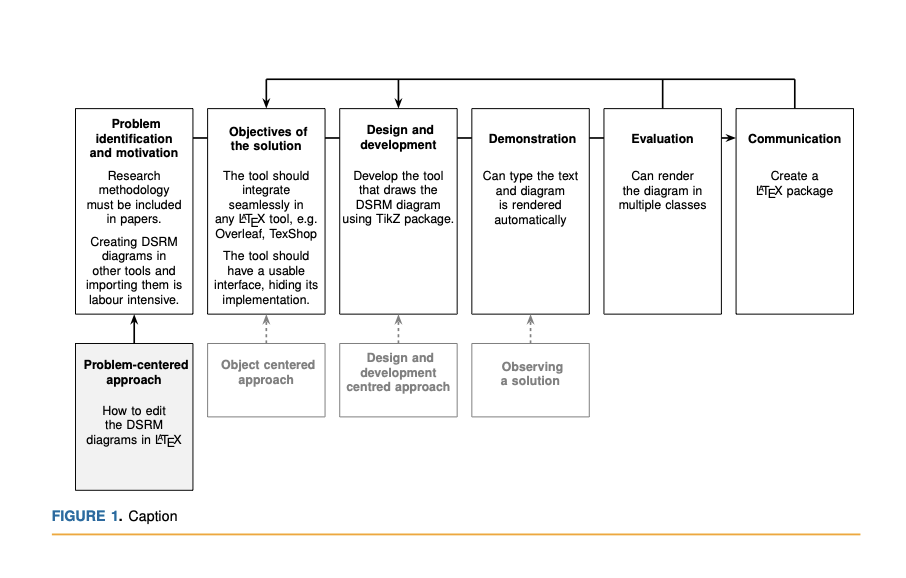

# Design Science Research methodology in Latex

This a package that allows you to create Design Science Research diagrams in Latex.

## Installation

Copy the `dsrm.sty` to your project.

## Usage

Write the text

```latex
\SDR{
    \ProblemIdentification[How to edit the DSRM diagrams in \LaTeX]{Research methodology must be included in papers.\\\vspace{8pt}Creating DSRM diagrams in other tools and importing them is labour intensive.}
    \ObjectivesOfTheSolution{The tool should integrate seamlessly in any \LaTeX\ tool, e.g. Overleaf, TexShop\\\vspace{8pt}The tool should have a usable interface, hiding its implementation.}
    \Demonstration{Can type the text and diagram is rendered automatically}
    \DesignAndDevelopment{Develop the tool that draws the DSRM diagram using TikZ package.}
    \Evaluation{Can render the diagram in multiple classes}
    \Communication{Create a \LaTeX\ package}
}
```

gives this result in IEEE Computer Science magazines projects:

